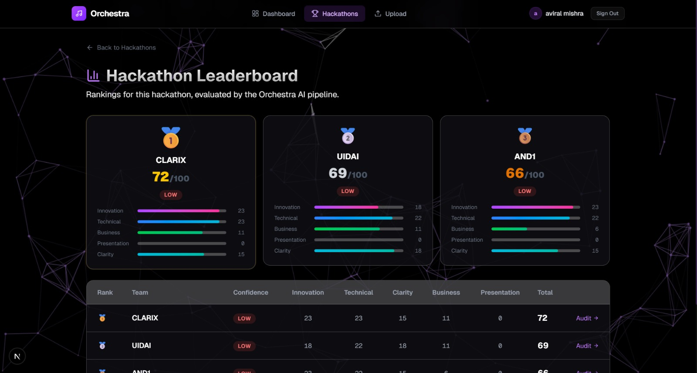
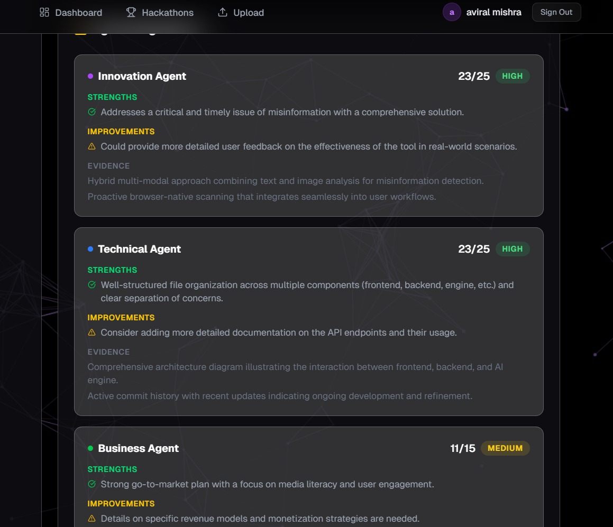

<div align="center">


<br /><br />

# 🎼 Orchestra

**AI-powered hackathon judging. Upload a spreadsheet. Get a leaderboard.**

Orchestra replaces the exhausting process of manually reviewing dozens of GitHub repos and pitch decks. Drop in a CSV of team submissions and the system evaluates every project through a multi-agent AI pipeline — scoring, ranking, and generating written feedback automatically.

</div>

---

## What It Looks Like

### Hackathon Leaderboard
Rankings for every team, with per-dimension breakdowns and confidence tiers at a glance.



### Team Result Page
Full score breakdown for a single team, with a downloadable feedback report and editable dimension scores.


### Agent Audit View
See exactly what each AI judge found — strengths, improvements, and evidence — before the chief judge calculated the final score.



---

## Features

- Upload a CSV and let evaluation run entirely in the background
- Five specialized AI judges, each scoring a different dimension
- Bias auditor that reviews all judge outputs before the final score is set
- Chief judge that sums everything up and assigns a confidence tier
- Auto-generated written feedback report for every team
- Live progress tracking during batch evaluation
- Global and per-hackathon leaderboard
- Manual score override system with judge name and reason

---

## Scoring System

Every submission is scored out of **100 points** across five categories. The five judge agents run in parallel, then the bias auditor and chief judge run on their combined outputs.

| Category     | Max | What it looks at |
|:-------------|:---:|:-----------------|
| Innovation   | 25  | Originality of the idea, creative problem-solving |
| Technical    | 25  | Code quality, architecture, complexity |
| Business     | 15  | Market opportunity, feasibility, monetization angle |
| Presentation | 15  | Pitch deck quality and storytelling |
| Clarity      | 20  | How well the problem and solution are communicated |

After scoring, the chief judge assigns one of three confidence tiers:

- **High** — strong evidence across all dimensions
- **Medium** — some gaps but enough signal to be reliable  
- **Low** — one or more agents had missing or weak input (e.g. no GitHub link)

---

## Tech Stack

### LLM and AI Models

Every agent in the pipeline calls **GPT-4o** directly. Temperature is set to `0.1` across all agents to keep outputs consistent and structured. GPT-4o was chosen because it handles both code reasoning (for GitHub repos) and language quality evaluation (for pitch decks) in the same call.

### Agent Framework

No external framework is used. The multi-agent system is a set of plain Node.js async functions coordinated by a custom orchestrator. The five judge agents run with `Promise.allSettled` so a single failure never blocks the rest. After they complete, the bias auditor and chief judge run in sequence.

```
Parser
  └─> [Innovation] [Technical] [Business] [Presentation] [Clarity]  ← parallel
        └─> Bias Auditor
              └─> Chief Judge
                    └─> Feedback Engine
```

### Fullstack and API

| Layer       | Technology                             |
|:------------|:---------------------------------------|
| Frontend    | Next.js 16, React 19, TypeScript       |
| Styling     | Tailwind CSS v4                        |
| Animations  | Framer Motion                          |
| Icons       | Lucide React                           |
| Backend     | Node.js, Express v5                    |
| Validation  | Zod                                    |
| File upload | Multer                                 |
| HTTP client | Axios                                  |

All responses follow a consistent shape: `{ success: boolean, data | error }`.

### Infrastructure

| Concern        | Solution                                                         |
|:---------------|:-----------------------------------------------------------------|
| Database       | **Neon DB** (serverless PostgreSQL) via the `pg` client with SSL |
| File storage   | Local `uploads/` folder via Multer                               |
| Job tracking   | In-memory object on the Express process                          |
| Secrets        | `.env` file with `dotenv`                                        |
| AI calls       | OpenAI API                                                       |

Neon DB is a serverless Postgres platform — it scales to zero when idle and requires no server to manage. The connection is configured via a `DATABASE_URL` environment variable with SSL enforced.

> **Note:** The in-memory job tracker resets if the server restarts mid-batch. For a more resilient setup, wire in a proper job queue like BullMQ.

---

## Project Structure

```
ORBIX/
├── backend/
│   ├── agents/
│   │   ├── innovationJudge.js      # Scores originality and creativity (out of 25)
│   │   ├── technicalJudge.js       # Scores code quality and architecture (out of 25)
│   │   ├── businessJudge.js        # Scores market viability (out of 15)
│   │   ├── presentationJudge.js    # Scores the pitch deck (out of 15)
│   │   ├── clarityJudge.js         # Scores communication quality (out of 20)
│   │   ├── biasAuditor.js          # Flags potential bias in judge outputs
│   │   └── chiefJudge.js           # Aggregates scores, assigns confidence tier
│   ├── db/
│   │   └── database.js             # SQLite setup and table definitions
│   ├── models/
│   │   └── schemas.js              # Zod validation for the upload request
│   ├── pipeline/
│   │   ├── orchestrator.js         # Runs the full evaluation pipeline
│   │   ├── parser.js               # Fetches and parses GitHub repos and PPTX files
│   │   └── feedbackEngine.js       # Generates the written feedback report
│   ├── uploads/                    # Temp folder for uploaded CSVs
│   ├── utils.js
│   └── server.js                   # Express server and all REST routes
│
└── frontend/
    ├── app/
    │   ├── dashboard/              # Main dashboard
    │   ├── hackathons/             # Hackathon list and per-hackathon leaderboard
    │   ├── upload/                 # CSV upload form
    │   ├── results/                # Individual team result and audit page
    │   ├── login/
    │   └── signup/
    ├── components/ui/              # Shared UI components
    └── public/
```

---

## CSV Format

Column names are matched case-insensitively, so variations like `"Team Name"` or `"team name"` both work.

| Column         | Accepted names                                              | Required |
|:---------------|:------------------------------------------------------------|:--------:|
| Team name      | team name, team, project name, project                      | ✅ |
| GitHub URL     | github url, github, repo url, repo                          | ✅ * |
| Pitch deck URL | pitch deck url, pitch deck, presentation, pptx url          | ✅ * |
| Prototype URL  | prototype url, prototype, demo link, demo                   | ❌ |

*At least one of GitHub URL or Pitch deck URL is required per row.

---

## API Reference

| Method | Endpoint                       | Description |
|:-------|:-------------------------------|:------------|
| POST   | `/api/hackathon/upload`        | Upload CSV and start batch evaluation |
| GET    | `/api/hackathon/progress/:id`  | Poll progress of a running batch job |
| GET    | `/api/hackathons`              | List all hackathons |
| GET    | `/api/leaderboard`             | Global leaderboard |
| GET    | `/api/leaderboard/:hackathon_id` | Per-hackathon leaderboard |
| GET    | `/api/results/:id`             | Full result for a single submission |
| GET    | `/api/stats`                   | Summary stats (total, average score, top team) |
| PUT    | `/api/override/:id`            | Submit a manual score override |

---

## Setup

**Requirements:** Node.js 18+, npm, an OpenAI API key.

**1. Clone the repo and install dependencies**

```bash
# Backend
cd backend
npm install

# Frontend (in a separate terminal)
cd frontend
npm install
```

**2. Configure the backend**

Create a `.env` file inside the `backend/` folder:

```env
OPENAI_API_KEY=your_key_here
DATABASE_URL=your_neon_postgres_connection_string
PORT=8000
```

You can get a free Neon DB connection string from [neon.tech](https://neon.tech). Create a project, copy the connection string from the dashboard, and paste it as `DATABASE_URL`.

**3. Start both servers**

```bash
# Terminal 1 — backend
cd backend
npm run dev

# Terminal 2 — frontend
cd frontend
npm run dev
```

Open your browser and go to `https://orchestra-eosin.vercel.app/`.

---

## How It Works

```
1. Organizer creates a hackathon and uploads a CSV from the Upload page
2. Backend reads each row and starts a background evaluation job
3. For each team, the parser fetches the GitHub repo and PPTX if available
4. Five judge agents evaluate the content in parallel using GPT-4o
5. Bias auditor reviews all judge outputs for flags
6. Chief judge calculates final score and confidence tier
7. Feedback engine writes a summary report for the team
8. Results are saved to SQLite and the leaderboard updates
9. Organizers can view breakdowns, read reports, and override scores
```

---

<div align="center">

Built for the people who run hackathons and hate spreadsheets.

</div>
